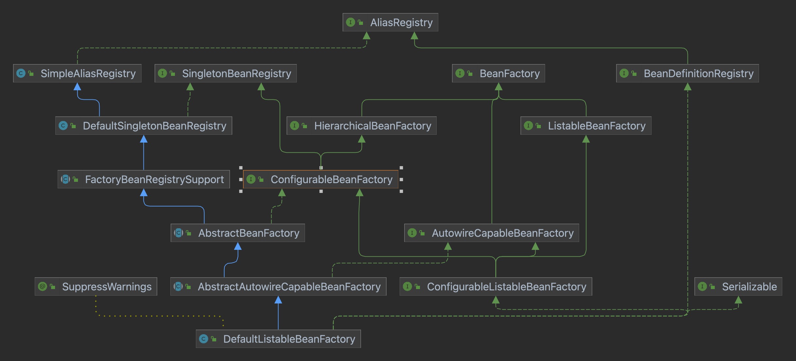

# spring_study
用于学习spring相关知识

#### 组件理解:
##### BeanWrapper:
   spring 提供的操作javaBean属性的工具类
````
BeanWrapper bw = PropertyAccessorFactory.forBeanPropertyAccess(new Object());
bw.setPropertyValue("设置属性key","设置属性value");
````
##### xxxAware:
   spring 提供，如果某个类想获取xxx，则通过实习xxxAware来获取

##### BootstrapRegistryInitializer
##### ApplicationContextInitializer
##### ApplicationListener
todo暂时不理解，都是通过 getSpringFactoriesInstances(class)从spring.factories中加载


--------------------------------------
#### 方法使用理解
##### List<T> getSpringFactoriesInstances(class type)
从spring.factories中加载指定类型的所有实现类


-------------------------------------
#### 类理解
##### BeanDefinition 
spring对bean的属性描述，类似java中的class类，其中包含 是否单例等属性
##### BeanDefinitionRegistry
即BeanDefinition容器，提供注册BeanDefinition和获取等基础接口
##### BeanDefinitionReader 
具体作用未知：提供注册BeanDefinition，然后放入registry中，此接口不必实现，只提供接口规范
##### BeanDefinitionScanner
提供扫描包方法，把符合的Bean注册到registry中


#### 额外工具 todo 详细去了解
Introspector 内省者 , PropertyDescriptor 属性描述符, BeanUtils , 
BeanWrapper , ResolvableType 可解析的类型 ,
ConversionService 类型转化服务 , Resource 资源类, Environment 环境类,
ApplicationEventMulticaster 事件发布订阅器


#### BeanFactory 相关接口学习

##### BeanFactory 提供基础获取bean的能力 ，getBean
##### ListableBeanFactory 继承 BeanFactory，额外提供列表功能，如是否包含beanDefinition
##### HierarchicalBeanFactory 继承 BeanFactory，提供父子分层能力
##### AutowireCapableBeanFactory 继承 BeanFactory，提供自动注册配置的能力
##### SingletonBeanRegistry 单例bean注册功能
##### ConfigurableBeanFactory 继承 HierarchicalBeanFactory, SingletonBeanRegistry
拥有分层和单例的接口
##### 

